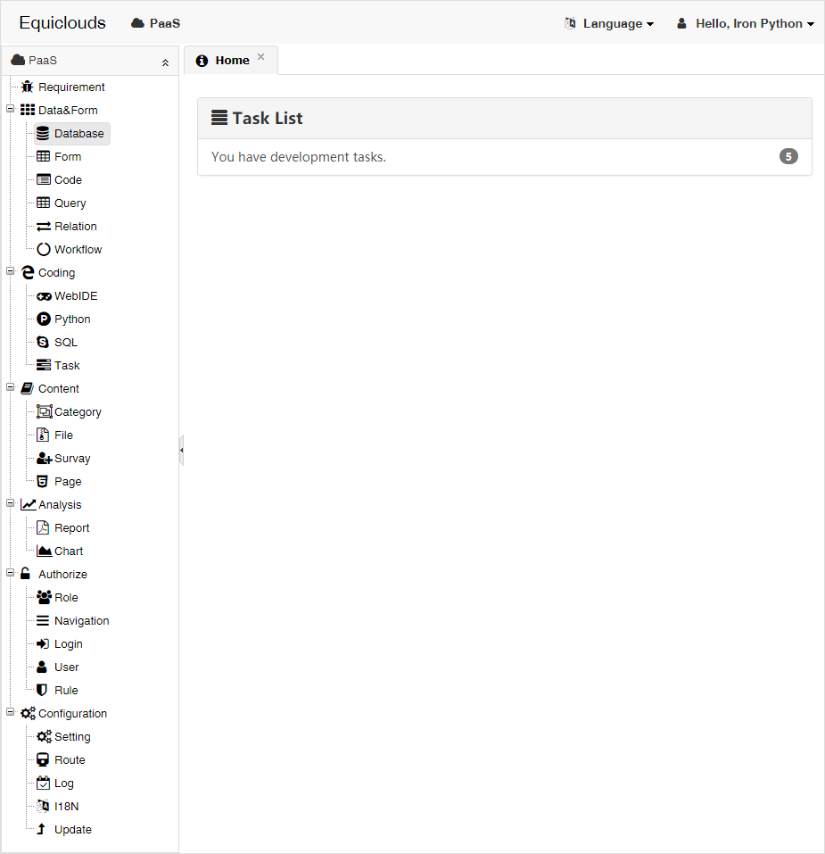

# [Equiclouds](http://www.equiclouds.com/)



## Features

Build better Web apps with CBSE by PaaS! 

A browser and a database tool can build the whole large web app:

* Automatic Management Interface
  * Automatically analyze data dictionaries, intelligently create data grids, rich custom configurations, dozens of form controls, comprehensive data validation, lightweight role workflows, powerful far wins Django admin backstage. Developers only focus on the Assembly and implementation of the components, without focusing on the development of the interface.
* Component-based Development
  * Component-based development provides a more organized reuse approach, the concept of "assembling rather than coding, integrating rather than implementing" provides data-driven business artifacts to dramatically improve the development speed and software quality of Web applications, dramatically lowering costs through the development platform online configuration, assembly and development of artifacts.
* Online Integrated Development Environment
  * Anytime, anywhere online coding, automatic preservation of historical version, intelligent dynamic compilation, detailed debug logs, lazy loading execution, code complement full code folding, grammar highlighting, full-screen mode, adaptive content size. You only need Web browsers and database management tools to build Web applications.

## Get Started

* First, buy a virtual server with Ubuntu Server 16.04/18.04 LTS X64 from any of the following cloud computing providers:
  * [Microsoft Azure](https://azure.microsoft.com/), [Amazon AWS](https://aws.amazon.com/)
  * [阿里云](https://promotion.aliyun.com/ntms/yunparter/invite.html?userCode=jrx3bb1f), [腾讯云](https://cloud.tencent.com/redirect.php?redirect=1014&cps_key=3903997dfdf207961c180fc52fd875cf&from=console)
 
* Second, login to the remote server by SSH client(e.g.[putty](https://www.chiark.greenend.org.uk/~sgtatham/putty/latest.html)), and install requirements:

> If you are using Ubuntu Server 14.04 LTS X64, you should install git, docker-ce, docker-compose manually before excuting the scripts. Other Linux versions, please check the scripts and implements the setup scripts by yourself.

```bash
sudo su
apt-get update && apt-get install git
cd /tmp
git clone https://github.com/equiclouds/equi-docker.git
rm -rf /usr/equi
mv /tmp/equi-docker /usr/equi
mkdir /usr/equi/tmp
python /usr/equi/script/setup.py
```

* Third, Create an app whose web server and database server are both hosted in docker:

```bash
python /usr/equi/script/app_create.py -appid 1 -appname app1 -server_name www.yourdomain.com -password password
```

  * appid, int, id of the app. port and ip of the container are related with appid.
  * appname, str, name of directory to host application files and database files.
  * server_name, the domain binded to the webserver.
  * password, the password of database user(postgres), and the password of super administator.  

You can specify the appid, appname, server_name, and password your app by change the params in the last line of scripts above.

When excuted, visit http://www.yourdomian.com to view the app. Of couse, you should first resolved the domain name to ip of the server. Otherwise your can visit http://yourserverip:10010 by ip and port!

> You can see the web server port and database server port with command:

```bash
docker ps -a
```

* Forth, automantically start web and database services at system startup.

```bash
vim /etc/rc.local
```

Edit the /etc/rc.local file, and add a row to execute start.py:

```
sudo python /usr/equi/script/start.py
exit 0
```

* Last, connect to the database server by database management tools(e.g. navicat, pgadmin) to create tables and views; login the develop platform by any browser(e.g. Chrome, Firfox, IE11+, Edge) to build web apps by assembling and integrating.

> Database Connection Parameters:

```
Host: got from admin interface of your cloud computing provider.
Port: got from docker-compose ps -a
Username: postgres
Password: set by yourself as parameter of python /usr/equi/script/app_create.py.
```

> WebApp Login:

```
Username: equiclouds
Password: set by yourself as parameter of python /usr/equi/script/app_create.py.
```

You can modify the password of WebAPP after login.

* Tips: You could create many apps in a server without conflict:

```bash
python /usr/equi/script/app_create.py -appid 2 -appname app2 -server_name www.yourdomain2.com -password password2
```

It is the world's premier Web development platform. Without setting up or managing any infrastructure, you only need to log on to start working. The component-based cloud development platform changes the development mode of Web application, and can create high quality Web applications faster and better. Have fun!

## Advanced

Before call setup.py, you can edit the Dockerfile to customize docker images.

### Customize Docker Image for Database Server

```bash
vim /usr/equi/image/db/Dockerfile
```

Modify it to change default collation and timezone.

```
FROM postgres:10
RUN localedef -i zh_CN -c -f UTF-8 -A /usr/share/locale/locale.alias zh_CN.UTF-8
ENV LANG zh_CN.UTF-8
```

### Customize Docker Image for Web Server

```bash
vim /usr/equi/image/web/Dockerfile
```

Modify it to change sources and timezone.

```bash
FROM ubuntu:18.04
RUN sed -i 's/archive.ubuntu.com/mirrors.aliyun.com/' /etc/apt/sources.list
RUN apt-get update -y
RUN apt-get install -y ttf-wqy-microhei libgdiplus locales tzdata sqlite
RUN rm -rf /var/lib/apt/lists/*
RUN rm /etc/localtime && ln -sf /usr/share/zoneinfo/Asia/Shanghai /etc/localtime
```

* sed: command to change sources of apt-get so that server can use mirror to speed up downloads.
* apt-get: install requirements for docker image. All the package are required.
* ln: change timezone.


### Customize Rule of Ports for Docker Containers

```bash
vim /usr/equi/script/app_create.py
```

The default rule is:

```python
    webport = 10000 + appid * 10 if appid else 80
    dbport = 20000 + appid * 10 if appid else 5432
```

Change the two rows to customize rule of ports for docker containers.

### Customize Ports for Docker Containers

Just modify the docker-compose.yml file in /var/www/appname directory.

### Customize Network for Docker Containers

The ip of default network in template is "10.10.appid.1". If it has conflict with internal network IP of your server, you shoud change it.

```bash
vim /usr/equi/tmpl/docker-compose.yml
```

You need to make three changes in this file, e.g. config in web, db container, and networks nodes. The following address are available for internal network IP, you can choose any of the ranges that not conflict with your server.

```
10.0.0.0－10.255.255.255
100.64.0.0－100.127.255.255
172.16.0.0－172.31.255.255
192.168.0.0－192.168.255.255
```
